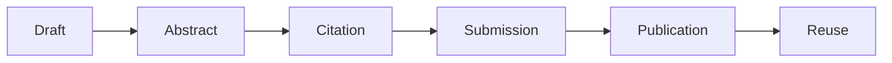

# Papers And Publications

## Overview

This repository organizes public research papers, conference submissions, abstracts, diagrams, LaTeX sources, citation metadata, and publication evidence related to cloud governance, site reliability engineering, FinOps, disaster recovery, observability, and AI-driven reliability.
It should also be easy to reference from the parent MCGR page so the publication library is visible as part of the larger ecosystem.

## Research Areas

- Multi-cloud governance
- Site Reliability Engineering
- AI-driven observability
- Disaster recovery governance
- SLO-driven cloud architecture
- Policy consistency and drift detection
- FinOps governance
- Enterprise cloud transformation

## Public SSRN Papers

1. A Multi-Cloud Governance and Site Reliability Engineering Framework for FinTech Platforms: A Case Study  
   https://papers.ssrn.com/abstract=6663578

2. AI-Driven Observability and Reliability Framework for Multi-Cloud Financial Platforms  
   https://papers.ssrn.com/abstract=6557159

3. A Standardized Multi-Cloud Governance Model for Policy Consistency and Drift Detection  
   https://papers.ssrn.com/abstract=6713338

4. Designing SLO-Driven Cloud Architectures: A Framework for Balancing Reliability, Performance, and Cost in Enterprise Systems  
   https://papers.ssrn.com/abstract=6617678

## Publication Flow



## Conference Activity

- CloudCom 2026
- FiCloud 2026
- AIBDCC 2026
- CISS 2026
- IEEE Manuscript ID: TAI-2026-Apr-A-00880

## How To Use This Repo

1. Review the publication registry and research pipeline.
2. Use the abstracts, citations, and bibliography together.
3. Keep LaTeX, PDFs, and conference materials aligned.
4. Record submission status as papers move from draft to published.

## Where This Fits In The Ecosystem

- [MCGR Framework](../MCGR-Framework/README.md)
- [MCGR Public Page](../MCGR-Framework/README.md#featured-research-spotlight)
- [Architecture Diagrams](../architecture-diagrams/README.md)
- [Cloud Transformation Case Studies](../cloud-transformation-case-studies/README.md)
- [Executive Technology Roadmaps](../executive-technology-roadmaps/README.md)

## Repository Structure

```text
ssrn/                    SSRN paper summaries and links
conference-submissions/  Conference submission tracking
ieee-style/              IEEE-formatted research versions
latex/                   LaTeX source files
pdfs/                    PDF paper copies/placeholders
diagrams/                Research diagrams and visuals
citations/               BibTeX and citation metadata
abstracts/               Paper abstracts
evidence/                Research pipeline and evidence notes
references/              Bibliography
```

## Core Content

- [Publication Registry](evidence/publication-registry.md)
- [Research Pipeline](evidence/research-pipeline.md)
- [Research Abstracts](abstracts/research-abstracts.md)
- [BibTeX](citations/bibtex.bib)
- [Bibliography](references/bibliography.md)

## Quick View

| Publication Area | Typical Content | Main Output |
| --- | --- | --- |
| SSRN | Working papers and abstracts | Public paper trail |
| Conferences | Submission and acceptance tracking | Submission evidence |
| Bibliography | Source management | Master reference list |
| Abstracts | Topic and methodology summaries | Reusable research copy |
| Citation Assets | BibTeX and DOI metadata | Consistent citation reuse |

## Publication Layers

| Layer | Question | Artifact |
| --- | --- | --- |
| Narrative | What is the paper about? | Abstract |
| Evidence | What supports it? | Publication registry |
| Citation | How is it referenced? | BibTeX / bibliography |
| Venue | Where was it shared? | SSRN / conference log |
| Reuse | How does it connect back? | Parent MCGR page link |
