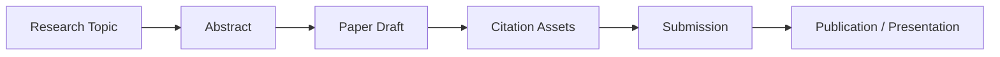

# Research Pipeline

| Paper | Venue / Platform | Status | Reference |
|---|---|---|---|
| A Multi-Cloud Governance and Site Reliability Engineering Framework for FinTech Platforms | SSRN / FiCloud 2026 | Public / Submitted | SSRN 6663578 |
| AI-Driven Observability and Reliability Framework for Multi-Cloud Financial Platforms | SSRN | Public | SSRN 6557159 |
| A Standardized Multi-Cloud Governance Model for Policy Consistency and Drift Detection | SSRN / CloudCom 2026 | Public / Submitted | SSRN 6713338 |
| Designing SLO-Driven Cloud Architectures | SSRN / AIBDCC 2026 | Public / Submitted | SSRN 6617678 |
| A Governance Framework for Multi-Cloud Architectures | CISS 2026 / IEEE | Submitted | TAI-2026-Apr-A-00880 |

## Pipeline Flow

## Notes

- keep the pipeline updated as status changes
- link each item to abstracts, citations, and diagrams

## Use

Use this pipeline as the shared view of what stage each paper is in and what supporting assets still need to be produced.

## Outcome

A visible pipeline makes it easier to keep research, submission, and publication work aligned.
